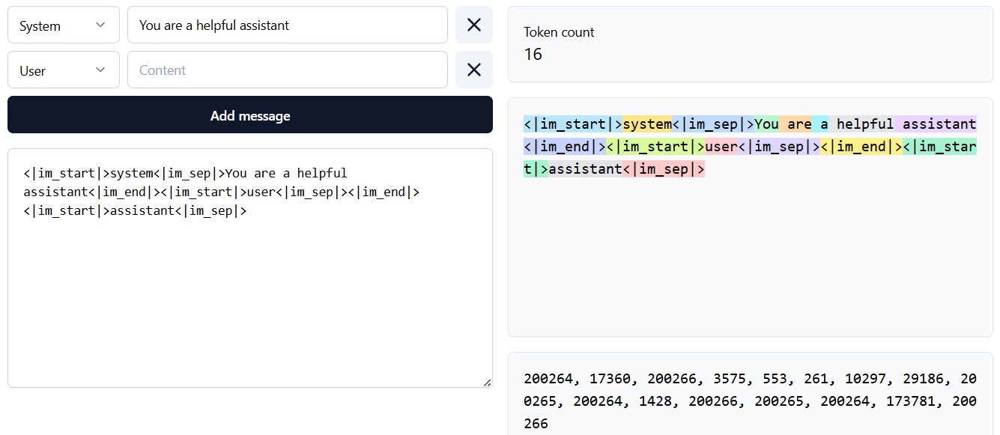
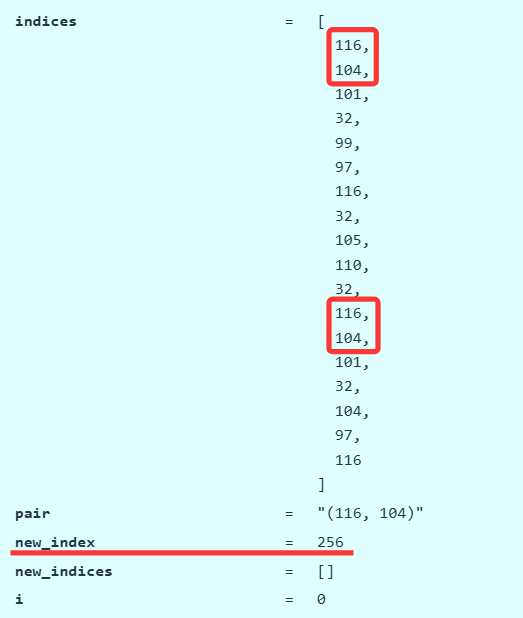

This unit was inspired by Andrej Karpathy's video on tokenization. [[video]](https://www.youtube.com/watch?v=zduSFxRajkE)

To get a feel for how tokenizers work, play with this [interactive site](https://tiktokenizer.vercel.app/?encoder=gpt2).




### Tokenization Methods

#### Character-based

#### Byte-based

#### Word-based

#### Byte Pair Encoding (BPE)

The BPE algorithm was introduced by Philip Gage in 1994 for data compression.  [[article]](http://www.pennelynn.com/Documents/CUJ/HTML/94HTML/19940045.HTM)

It was adapted to NLP for neural machine translation.  [[Sennrich+ 2015]](https://arxiv.org/abs/1508.07909)

**Basic idea**: *train* the tokenizer on raw text to automatically determine the vocabulary.

**Intuition**: common sequences of characters are represented by a single token, rare sequences are represented by many tokens.

```python
def merge(indices: list[int], pair: tuple[int, int], new_index: int) -> list[int]:  # @inspect indices, @inspect pair, @inspect new_index
    """Return `indices`, but with all instances of `pair` replaced with `new_index`."""
    new_indices = []  # @inspect new_indices
    i = 0  # @inspect i
    while i < len(indices):
        if i + 1 < len(indices) and indices[i] == pair[0] and indices[i + 1] == pair[1]:
            new_indices.append(new_index)
            i += 2
        else:
            new_indices.append(indices[i])
            i += 1
    return new_indices

def train_bpe(string: str, num_merges: int) -> BPETokenizerParams:  # @inspect string, @inspect num_merges
    Start with the list of bytes of string.
    indices = list(map(int, string.encode("utf-8")))  # @inspect indices
    merges: dict[tuple[int, int], int] = {}  # index1, index2 => merged index
    vocab: dict[int, bytes] = {x: bytes([x]) for x in range(256)}  # index -> bytes
    for i in range(num_merges):
        Count the number of occurrences of each pair of tokens
        counts = defaultdict(int)
        for index1, index2 in zip(indices, indices[1:]):  # For each adjacent pair
            counts[(index1, index2)] += 1  # @inspect counts
        Find the most common pair.
        pair = max(counts, key=counts.get)  # @inspect pair
        index1, index2 = pair
        Merge that pair.
        new_index = 256 + i  # @inspect new_index
        merges[pair] = new_index  # @inspect merges
        vocab[new_index] = vocab[index1] + vocab[index2]  # @inspect vocab
        indices = merge(indices, pair, new_index)  # @inspect indices
    return BPETokenizerParams(vocab=vocab, merges=merges)
```



