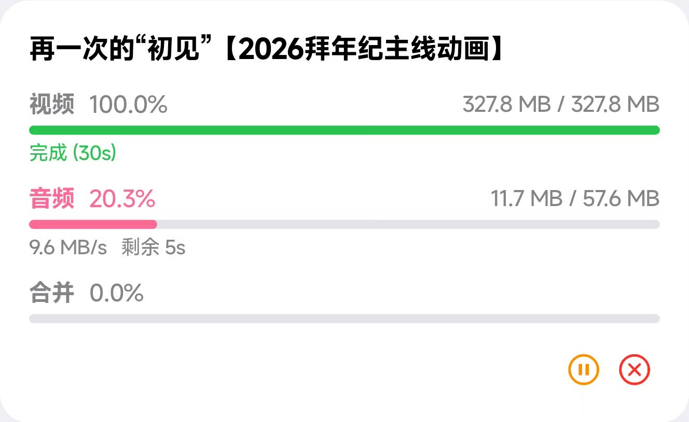

最近翻自己项目的时候，我又看了一眼 **[BiCone](https://github.com/IT-Bill/BiCone)**，然后忍不住想：这东西的出发点其实非常朴素，甚至有点“民间智慧”。

就是——**我不想哪天想看某个视频的时候，页面上只剩一句“视频已失效”。**

这种感觉很烦。

你记得自己明明收藏过、也记得它当时很重要，结果某天想再回头看，B站温柔地告诉你：没了。

所以 BiCone 想做的事很直接：**把“追更”和“缓存”这两件事合在一起。**

它不是那种“让我下载一切”的野路子工具，至少我做它时脑子里想的不是那个。它更像一个：

- 帮你订阅喜欢的 UP 主
- 自动监测有没有更新
- 有更新就提醒你
- 顺手把视频缓存到本地

也就是说，它的重点不是“下载器”三个字，而是 **“别等失效了才后悔”**。

## 这项目是干嘛的

一句人话版介绍：

> **BiCone 是一个给 Bilibili 用的“防失效追更工具”。**

你可以把它理解成一种“缓存型追番器”，只是对象从番剧变成了你关注的 UP 主。

流程也不复杂：

1. 登录 B 站账号
2. 添加想关注的 UP 主 UID
3. 开着它，或者让它在后台待着
4. 新视频一来，它就帮你盯着，甚至直接缓存下来

这个思路我自己挺喜欢的，因为它不需要你每次都记得“回去看看更没更新”。

有些工具的工作方式像在说：

> 你自己勤快点，多点几次刷新。

BiCone 的工作方式更像：

> 你去忙你的，更新来了我叫你。

## 我为什么会想做这种东西

因为人其实很容易高估自己的记性，也很容易低估内容失效的速度。

尤其是视频内容——今天还在，明天可能就寄了。

如果只是“看过就算”，那当然无所谓。但很多视频并不是纯消遣：

- 可能是某个教程
- 可能是某段演讲
- 可能是某个以后还想反复看的讲解
- 也可能单纯就是你很喜欢，没什么大道理，但就是不想它消失

而我很不喜欢那种“本来可以早点保存，但当时懒了一下，于是现在没了”的剧情。

所以从思路上说，BiCone 更像是一个**主动出击的内容保险箱**。

## 它好用的点，基本都在“省心”上

### 1. 订阅一次，后面少操心

BiCone 支持直接添加你想追的 UP 主。后面监测更新这件事，它会自己做。

说白了，这比“我每隔几天手动点进主页看一下”文明太多了。

手动追更这种事，短期靠热情，长期靠玄学。

### 2. 更新通知 + 自动缓存，这组合很关键

单独“通知我更新了”，其实只解决了一半问题。

因为通知到了，你还是可能会想：

- 晚点再看
- 回头再下载
- 这会儿网络不好
- 算了明天再弄

然后明天的你会把锅甩给今天的你，后天的视频可能就已经不见了。

所以我觉得更舒服的方案是：**监测、提醒、缓存，最好一条龙。**

这样它就不只是“告诉你有事发生”，而是顺手把麻烦也处理掉一部分。

### 3. 多画质和多线程下载，不只是“能下”，而是“别太折磨人”

如果一个缓存工具最后下载速度慢得像在练耐心，或者画质选项抠抠搜搜，那体验其实还是差一截。

BiCone 在这块支持：

- 多画质选择
- 多线程分段下载
- 下载管理和断点续传

很难说这些特性有多浪漫，但它们确实能减少那种“工具明明有了，结果还是不好用”的挫败感。

## 我挺喜欢 BiCone 的一个地方：它看起来不像很吵的工具

很多工具会努力让自己显得很厉害，页面里到处都是“我很强我很强”。

BiCone 反而比较像那种：**平时安静待着，等真有更新了再出来干活。**

这个气质我自己挺喜欢。

它不是天天抢你注意力的东西，而是那种“需要时可靠，不需要时别烦我”的工具。

## 界面大概长这样

先放两张图，感受一下它的整体味道。

### 订阅 / 追更入口

我挺喜欢这个页面传达出来的感觉：不是那种功能堆满、按钮打架的界面，而是比较明确地告诉你——这个工具就是来帮你盯更新的。

### 下载 / 缓存能力展示

这块也很直白：更新来了，不只是“我知道了”，而是“我可以开始处理了”。

## 技术上它其实也挺有意思

BiCone 不是只做一个单平台的小玩具，它目前瞄准的是：

- Android
- iOS
- Windows

也就是说，它从一开始就不是“先随便写一个 demo 再说”，而是更接近一个认真想过使用场景的跨平台项目。

项目本身是 **Flutter** 做的，这个选择很合理：

- 一套代码覆盖多个平台
- UI 和交互能比较统一
- 对这种偏应用型的小工具很合适

另外，从仓库里能看到它把“订阅监测”“下载”“通知”“存储”“更新检查”这些东西拆得挺清楚，不是那种所有逻辑一锅乱炖的写法。对这种会继续长功能的项目来说，这点挺重要。

## 还有一个我觉得很现实的点：它不是在假装没有边界

BiCone 的 README 里其实写得挺明确：

- 项目用于技术研究和学习探讨
- 工具本身不提供受版权保护的内容
- 使用者需要自己确保行为合法合规

我觉得这反而是成熟的表现。

有些项目最尴尬的地方，就是一边做得很明白，一边又装作什么都没发生。还不如直接把边界讲清楚。

## 如果用一句话概括我对 BiCone 的感觉

那大概就是：

**它不是一个“哇好炫”的项目，而是一个“这个我真的会想留在设备里”的项目。**

我自己挺偏爱这种工具。

不是为了演示某个技术点有多花，而是真的在解决一个很具体、很烦、而且很容易让人后悔的问题。

你可以不用每天都想到它，但等你某天回头看，发现想留住的内容还在，那它就已经完成任务了。

## 相关链接

- 项目仓库：<https://github.com/IT-Bill/BiCone>
- 部署网站：<https://bicone.it-bill.com/>
- Releases：<https://github.com/IT-Bill/BiCone/releases/latest>

如果你也是那种对“视频已失效”四个字有点 PTSD 的人，那这个项目你大概会懂。